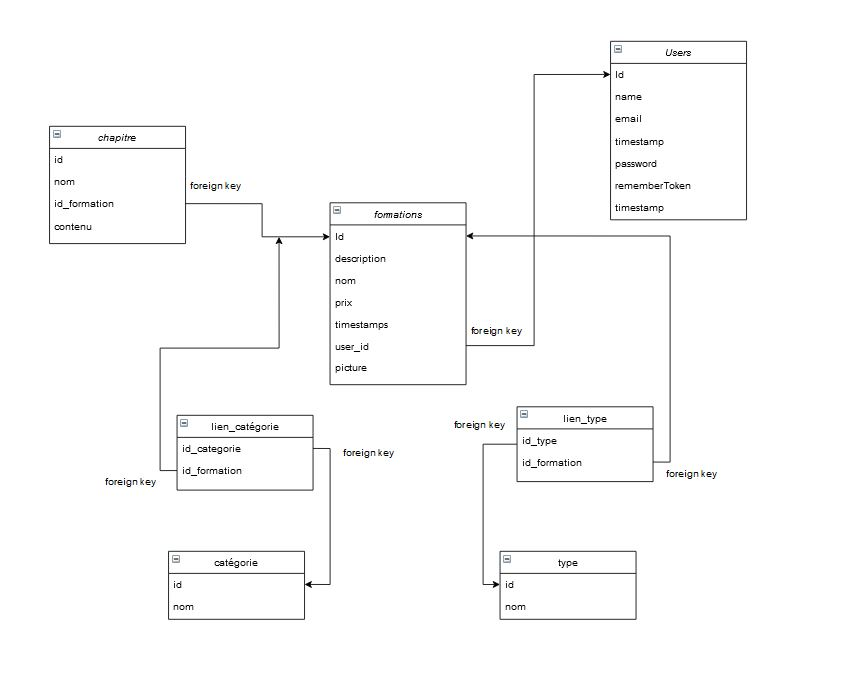

<p align="center"><a href="https://laravel.com" target="_blank"></a></p>

<p align="center">
<a href="https://travis-ci.org/laravel/framework"></a>
<a href="https://packagist.org/packages/laravel/framework"></a>
<a href="https://packagist.org/packages/laravel/framework"></a>
<a href="https://packagist.org/packages/laravel/framework"></a>
</p>

## Context de la plateforme

Le projet a pour but de créer une plateforme de formations en ligne.
3 profils son demandé :
- Visiteur: accède à la liste des formations et peut consultant les details de celle-ci
- formateur : c'est un visiteur qui à travers un formulaire de contact, demande à l'administrateur  de devenir formateur afin de créer et modifier ses formations.
- administrateur : permet d'accepter les demandes pour devenir formateur qu'il recevra par e-mail et aussi consulter la liste des formations, modifier, ajouter ou supprimer une formation.

Actuellement, la plateforme permet:
-Accéder à une liste de formation
-Accéder aux détails d'une formation

## Avancé du projet
Actuellement, la plateforme permet:
- Accéder à une liste de formation avec ses détails(nom, description, prix, date de création, catégories, types)
- Accéder aux détails d'une formation
- modifier les informations de la formation (nom, prix, description, image)
- ajouter/supprimer un chapitre
- Ajouter une formation

Actuellement, la plateforme ne permet pas:
- N'a pas de système d'autenthification et donc de profil (chapitre 5, 6, 7)
- modifier un chapitre 
- créer des catégories/listes et les ajouter à une formation


## Les problèmes rencontrés
le premier problème que j'ai rencontré à été au niveau du mymls qui ne permet pas de naviguer de façon libre sur les videos qu'on a déja vu ce qui m'a ralenti.

j'ai rencontré un problème au niveau du peuplement de mes tables pivots qui fait que je me retrouve avec des formations qui n'ont pas de catégorie ou de type ou encore qui on deux fois le même type ou catégorie.

j'ai eu une contrainte au niveau du temps qui ne m'a pas permis de terminer le projet.


## Les commandes à utiliser

- Une fois le projet telecharger faire : ```composer install```
- Si un fichier ".env" ne sait pas créer automatiquement, copier le fichier ".env.example" (sans oublié de le renommer) puis exécutez la commande suivante : ```php artisan key:generate```.
- la base de donnée à pour nom : laravelprojetm1
-N'oubliez pas de mettre le nom de la base de données dans le champs DB_DATABASE= de votre fichier ".env" ainsi que votre configuration MySql.

- faire un ```php artisan migrate``` pour créer les données dans la base
- faire un ```php artisant db:seed``` pour peupler la base de donnée
- faire un ```php artisan storage:link``` pour lien le dossier public au dossier storage
- ```php artisan serve``` pour lancer le projet
- le projet est accessible  à l'adresse suivante : http://localhost:8000/


## Documentation technique

- MCD : disponible dans le dossier bdd_mcd au format jpg
 

## License

The Laravel framework is open-sourced software licensed under the [MIT license](https://opensource.org/licenses/MIT).

